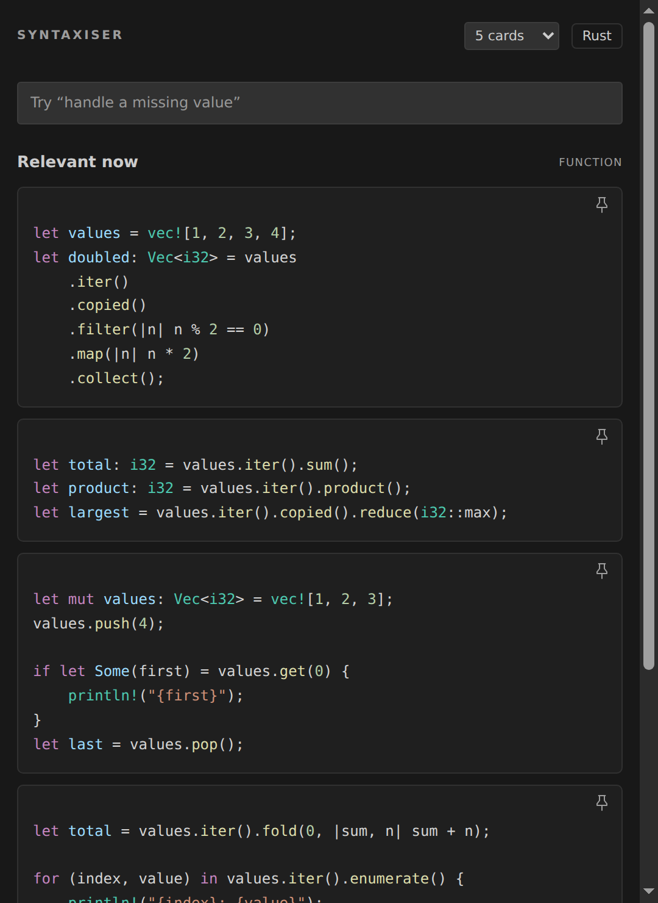
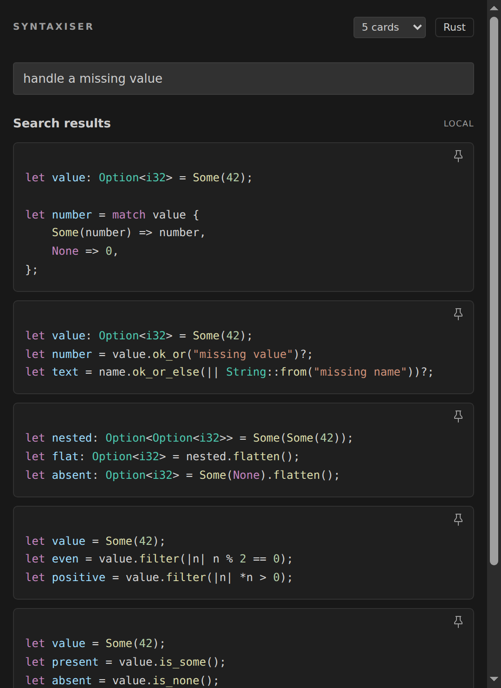
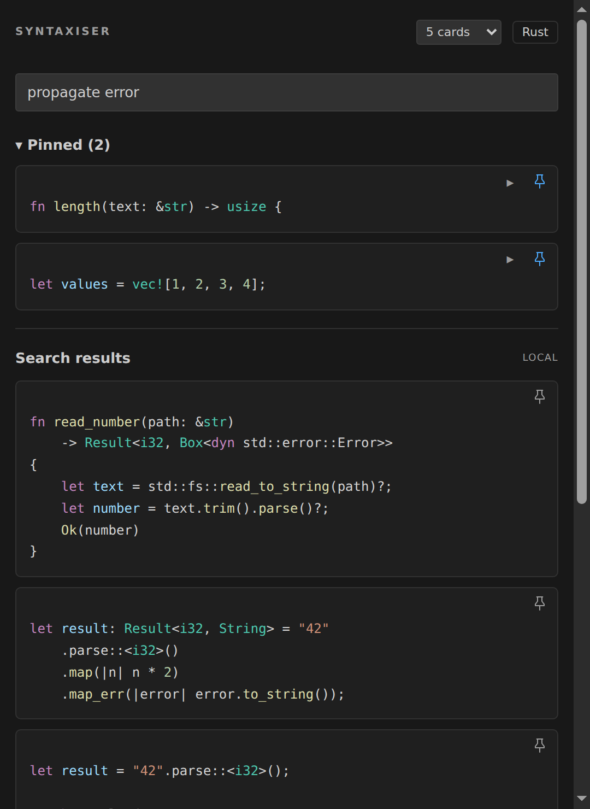

# Syntaxiser

**Rust syntax examples beside the code you're writing.** Syntaxiser is a VS Code sidebar with 211 curated snippets across 83 concepts. Move your cursor to see relevant examples, search for what you want to do, and pin the ones you keep reaching for.

Everything runs locally: no API key, network requests, telemetry, or language model. Rust-analyzer is optional.

| Move your cursor | Search in plain language |
| --- | --- |
| [](docs/screenshots/context.png) | [](docs/screenshots/search.png) |

*Click a screenshot to enlarge it. These captures use the extension's actual sidebar renderer and Rust retrieval results with a dark theme and five cards selected; editor chrome is omitted.*

## A one-minute tour

Open a `.rs` file, select the Syntaxiser book icon in the Activity Bar, or run **Syntaxiser: Open Reference** from the Command Palette. Try [examples/context-tour.rs](examples/context-tour.rs):

1. Put your cursor near the top-level `use` statement. **Relevant now** shows file-scope examples such as imports and declarations.
2. Move to `let maybe_user: Option<User> = …` inside `main`. The examples shift toward handling optional values.
3. Move to the `.iter().map(…).collect()` line. Iterator and collection examples move up the list.
4. Search for **read without moving**. The list switches to search results, including borrowing with `&str`.
5. Pin a useful card, then clear the search. Contextual examples return, and your pin stays above them.

Cards show code only. Hover over a snippet or its **ⓘ** button for a short explanation in a styled panel that follows VS Code's theme. Click **ⓘ** to keep it open, or focus the button and press Enter or Space. Close it with Escape, the close button, or a click outside. The panel wraps within the sidebar and opens above the snippet when needed; card dimensions and copied code stay unchanged. The examples are fixed reference snippets; some use illustrative names or require surrounding code and dependencies.

## Search recipes

You can search by syntax (`split_at_mut`, `sort_by_key`, `get_or_insert_with`) or by the task you're trying to remember:

| Search for | Examples you'll find |
| --- | --- |
| `handle a missing value` | `Option`, `Some` / `None`, `match`, converting to `Result` |
| `read without moving` | Shared references and borrowing with `&str` |
| `change through reference` | `&mut` and mutable borrowing |
| `transform collection` | `.iter()`, `.filter()`, `.map()`, `.collect()` |
| `string arrays` | Fixed arrays of `&str` and `String`, plus initialization with `from_fn` |
| `string vectors` | Growable `Vec<&str>` and `Vec<String>` collections |
| `propagate error` | `Result` and the `?` operator |
| `key value lookup table` | `HashMap`, lookup, and updating entries |
| `read file line by line` | `BufReader` and `.lines()` |
| `stop on first error` | Collecting an iterator into `Result<Vec<_>, _>` |
| `web server` | Axum and Actix Web startup, routing, and server state |

Search replaces **Relevant now** while the box contains text. Clear it to resume cursor-based suggestions. Queries outside the curated pack may return no cards; try a concept or library name.

## Examples you can keep beside your code

### Handle an optional value

Search **handle a missing value** when you need to remember the shape of a `match`:

```rust
let value: Option<i32> = Some(42);

let number = match value {
    Some(number) => number,
    None => 0,
};
```

The same search also finds ways to filter an `Option`, flatten nested options, or turn a missing value into an error.

### Borrow a string and keep using it

Search **read without moving** for an example of accepting a shared reference:

```rust
fn length(text: &str) -> usize {
    text.len()
}

let text = String::from("hello");
let size = length(&text);
println!("{text}: {size}");
```

The caller still owns `text` after the function returns. For a function that changes the value, try **change through reference** instead.

### Filter, transform, and collect

Move onto an iterator chain or search **transform collection**:

```rust
let values = vec![1, 2, 3, 4];
let doubled: Vec<i32> = values
    .iter()
    .copied()
    .filter(|n| n % 2 == 0)
    .map(|n| n * 2)
    .collect();
```

This produces `[4, 8]`. Nearby cards cover `fold`, `sum`, `enumerate`, `zip`, and choosing between `iter`, `iter_mut`, and `into_iter`.

### Return early on an error

Search **propagate error** for a function that uses `?` for both file I/O and parsing:

```rust
fn read_number(path: &str)
    -> Result<i32, Box<dyn std::error::Error>>
{
    let text = std::fs::read_to_string(path)?;
    let number = text.trim().parse()?;
    Ok(number)
}
```

For a file containing `42`, this returns `Ok(42)`. A missing file or invalid integer returns an error to the caller.

### Read a file one line at a time

Search **read file line by line** for buffered reading:

```rust
use std::fs::File;
use std::io::{BufRead, BufReader};

let reader = BufReader::new(File::open("input.txt")?);
for line in reader.lines() {
    let line = line?;
    println!("{line}");
}
```

Use this fragment inside a function that returns a compatible `Result`. Related cards cover buffered writing and reading standard input.

### Remember how to start a web server

Search **web server** for Axum and Actix Web alternatives. For example, the Axum card shows a `/health` route:

```rust
use axum::{routing::get, Router};

let app = Router::new()
    .route("/health", get(|| async { "healthy" }));
let listener = tokio::net::TcpListener::bind("127.0.0.1:8080").await?;
axum::serve(listener, app).await?;
```

This fragment needs Axum 0.8, Tokio with the runtime and networking features it uses, and an async function returning a compatible `Result`. The sidebar supplies reference code; add the crates to your own project. More specific searches include **axum json response**, **actix query parameters**, and **request middleware**.

## Keep a small personal reference

Pin a borrowing example and an iterator pipeline, then search **propagate error**. Both pins stay at the top while the search results change:

<a href="https://github.com/sbracegirdle/syntaxiser/blob/main/docs/screenshots/pins.png"></a>

- Click a card's pin icon to keep it; click it again to unpin.
- Use the arrow on a pin to collapse it to its first line, or click **Pinned** to fold the entire group.
- Pins and collapse choices survive cursor movement, searches, and VS Code reloads in the same workspace.
- Choose 5, 12, 20, or 30 initial cards in the header. **Show more** reveals further results, up to sixty; pins have their own space above the list.

## Install from source

Requires VS Code 1.90 or newer, plus Node for building the package. The Node version is recorded in [.nvmrc](.nvmrc).

```sh
git clone https://github.com/sbracegirdle/syntaxiser.git
cd syntaxiser
nvm install
nvm use
npm ci
npm run package
```

In VS Code, run **Extensions: Install from VSIX…** and select the generated `syntaxiser-0.4.3.vsix`. Open a Rust file and run **Syntaxiser: Open Reference**. When updating an installed version, accept the reload prompt.

## Settings

The default is twelve cards per section, with updates after a 350 ms pause in cursor movement or edits.

```json
{
  "syntaxiser.maxCards": 5,
  "syntaxiser.debounceMs": 350
}
```

| Setting | Default | Range |
| --- | --- | --- |
| `syntaxiser.maxCards` | 12 | 3–30 initial cards; Show more reveals additional cards |
| `syntaxiser.debounceMs` | 350 | 100–2000 ms |

The card-count menu saves to the existing setting's scope, or to user settings when there is no override. Settings follow the active document, including workspace-folder and language overrides.

## Develop and contribute

Add this project folder to your existing VS Code workspace. After installing dependencies, run `npm test`, select **Run Syntaxiser** in Run and Debug, and press F5 to open the Extension Development Host with the tour file.

The test suite covers retrieval, scope scanning, controller events, rendering, search, pins, paging, settings, and syntax highlighting. With `rustfmt` installed, `npm run check:rust` also parses the reference cards as Rust fragments.

See [how Syntaxiser works](docs/how-it-works.md) for ranking, offline behavior, accessibility, implementation limits, adding a language, and validation details. The reference content lives in [packs/rust.json](packs/rust.json); [THIRD_PARTY_NOTICES.md](THIRD_PARTY_NOTICES.md) covers bundled highlighting licenses.

Licensed under [MIT](LICENSE).
